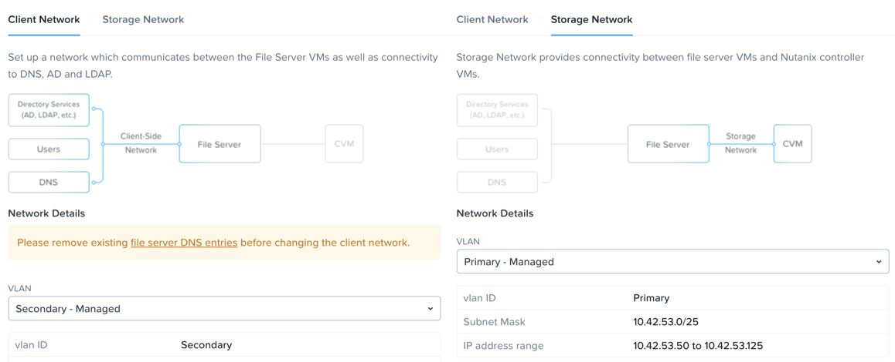

.. title:: Files

--------------------------------
Consolidating Storage with Files
--------------------------------

*The estimated time to complete this lab is 45 minutes.*

Traditionally, file storage has been yet another silo within IT, introducing unnecessary complexity and suffering from the same issues of scale and lack of continuous innovation seen in SAN storage. Nutanix believes there is no room for silos in the Enterprise Cloud. By approaching file storage as an app, running in software on top of a proven HCI core, Nutanix Files  delivers high performance, scalability, and rapid innovation through One Click management.

**In this lab you will work with Files to manage SMB shares and NFS exports and explore the new functionality for Files deployments with File Analytics.**

For the purpose of time, and sharing infrastructure resources, a Files cluster has already been provisioned on your cluster. The **BootcampFS** Files is a single node instance, typical **Files** deployments would start with 3 File Server VMs, with the ability to scale up and scale out as required for performance.

**BootcampFS** has been configured to use the **Primary** network to communicate with the backend storage, iSCSI connections from the **CVM** to **Volume Groups**, and the **Secondary** network for communication with clients, Active Directory, anti-virus services, etc.

.. note::

  It is typically desirable in production environments to deploy Files with dedicated virtual networks for client and storage traffic. When using two networks, Files will, by design, disallow client traffic the storage network, meaning VMs assigned to the primary network will be unable to access shares.

As Files leverages Nutanix Volume Groups for data storage, it can take advantage of the same underlying storage benefits such as compression, erasure coding, snapshots, and replication.

In **Prism Element > File Server > File Server**, select **BootcampFS** and click **Protect**.

   .. figure:: images/10.png

Observe the default Self Service Restore schedules, this feature controls the snapshot schedule for Windows' Previous Versions functionality. Supporting Windows Previous Versions allows end users to roll back changes to files without engaging storage or backup administrators. Note these local snapshots do not protect the file server cluster from local failures and that replication of the entire file server cluster can be performed to remote Nutanix clusters.

Managing SMB Shares
+++++++++++++++++++

In this exercise you will create and test a SMB share, used to support the unstructured file data needs of a cross-departmental team for the Fiesta application.

Creating the Share
..................

#. In **Prism Element > File Server**, click **+ Share/Export**.

#. Fill out the following fields:

   - **Name** - *Initials*\ **-FiestaShare**
   - **Description (Optional)** - Fiesta app team share, used by PM, ENG, and MKT
   - **File Server** - **BootcampFS**
   - **Share Path (Optional)** - Leave blank. This field allows you to specify an existing path in which to create the nested share.
   - **Max Size (Optional)** - 200GiB
   - **Select Protocol** - SMB

   .. figure:: images/2.png

   Because this is a single node AOS cluster and therefore a single file server VM, all shares will be **Standard** shares. A Standard share means that all top level directories and files within the share, as well as connections to the share, are served from a single file server VM.

   If this were a three node Files cluster or larger you’d have an option to create a **Distributed** share.  Distributed shares are appropriate for home directories, user profiles, and application folders. This type of share shards top level directories across all Files VMs and load balances connections across all Files VMs within the Files cluster.

#. Click **Next**.

#. Select **Enable Access Based Enumeration** and **Self Service Restore**. Select **Blocked File Types** and enter a comma separated list of extensions like .flv,.mov.

   .. figure:: images/3.png

   .. note::

      **Access Based Enumeration (ABE)** ensures that only files and folders which a given user has read access are visible to that user. This is commonly enabled for Windows file shares.

      **Self Service Restore** allows users to leverage Windows Previous Version to easily restore individual files to previous revisions based on Nutanix snapshots.

      **Blocked File Types** allow Files administrators to restrict certain types of files (such as large, personal media files) from being written to corporate shares. This can be configured on a per Server or per Share basis, with per Share settings overriding Server wide settings.

#. Click **Next**.

#. Review the **Summary** and click **Create**.

   .. figure:: images/4.png

   It is common for shares utilized by many people to leverage quotas to ensure fair use of resources. Files offers the ability to set either soft or hard quotas on a per share basis for either individual users within Active Directory, or specific Active Directory Security Groups.

#. In **Prism Element > File Server > Share/Export**, select your share and click **+ Add Quota Policy**.

#. Fill out the following fields and click **Save**:

   - Select **Group**
   - **User or Group** - SSP Developers
   - **Quota** - 10 GiB
   - **Enforcement Type** - Hard Limit

   .. figure:: images/9.png

#. Click **Save**.

Testing the Share
.................

#. Connect to your *Initials*\ **-WinTools** VM via VM console as a **non-Administrator NTNXLAB** domain account:

   .. note::

      You will not be able to connect using these accounts via RDP.

   - user01 - user25
   - devuser01 - devuser25
   - operator01 - operator25
   - **Password** nutanix/4u

   .. figure:: images/16.png

   .. note::

     The Windows Tools VM has already been joined to the **NTNXLAB.local** domain. You could use any domain joined VM to complete the following steps.

#. Open ``\\BootcampFS.ntnxlab.local\`` in **File Explorer**.

#. Open a browser within your *Initials*\ **-WinTools** desktop and download sample data to populate in your share:

   - **If using a PHX cluster** - http://10.42.194.11/workshop_staging/peer/SampleData_Small.zip
   - **If using a RTP cluster** - http://10.55.251.38/workshop_staging/peer/SampleData_Small.zip

#. Extract the contents of the zip file into your file share.

   .. figure:: images/5.png

   - The **NTNXLAB\\Administrator** user was specified as a Files Administrator during deployment of the Files cluster, giving it read/write access to all shares by default.
   - Managing access for other users is no different than any other SMB share.

..   #. From ``\\BootcampFS.ntnxlab.local\``, right-click *Initials*\ **-FiestaShare > Properties**.

   #. Select the **Security** tab and click **Advanced**.

      .. figure:: images/6.png

   #. Select **Users (BootcampFS\\Users)** and click **Remove**.

   #. Click **Add**.

   #. Click **Select a principal** and specify **Everyone** in the **Object Name** field. Click **OK**.

      .. figure:: images/7.png

   #. Fill out the following fields and click **OK**:

      - **Type** - Allow
      - **Applies to** - This folder only
      - Select **Read & execute**
      - Select **List folder contents**
      - Select **Read**
      - Select **Write**

      .. figure:: images/8.png

   #. Click **OK > OK > OK** to save the permission changes.

   All users will now be able to create folders and files within the *Initials*\ **-FiestaShare** share.

#. Open **PowerShell** and try to create a file with a blocked file type by executing the following command:

   .. code-block:: PowerShell

      New-Item \\BootcampFS\INITIALS-FiestaShare\MyFile.flv

   Observe that creation of the new file is denied.

#. Return to **Prism Element > File Server > Share/Export**, select your share. Review the **Share Details**, **Usage** and **Performance** tabs to understand the high level information available on a per share basis, including the number of files & connections, storage utilization over time, latency, throughput, and IOPS.

   .. figure:: images/11.png

   In the next exercise, you will see how Files can provide further insights into usage of each File Server and Share.

File Analytics
++++++++++++++

In this exercise you will explore the new, integrated File Analytics capabilities available in Nutanix Files, including scanning existing shares, creating anomaly alerts, and reviewing audit details. File Analytics is deployed in minutes as a standalone VM through an automated, One Click operation in Prism Element. This VM has already been deployed and enabled in your environment.

#. In **Prism Element > File Server > File Server**, select **BootcampFS** and click **File Analytics**.

   .. figure:: images/12.png

   .. note::

      File Analytics should already be enabled, but if prompted you will need to provide your Files administrator account, as Analytics will need to be able to scan all shares.

      - **Username**: NTNXLAB\\administrator
      - **Password**: nutanix/4u

      .. figure:: images/old13.png

#. As this is a shared environment, the dashboard will likely already be populated with data from shares created by other users. To scan your newly created share, click :fa:`gear` **> Scan File System**. Select your share and click **Scan**.

   .. figure:: images/14.png

   .. note::

      If your share is not shown, please give it some time to get populated...

#. Close the **Scan File System** window and refresh your browser.

#. You should see the **Data Age**, **File Distribution by Size** and **File Distribution by Type** dashboard panels update.

   .. figure:: images/15.png

   Under....

#. From your *Initials*\ **-WinTools** VM, create some audit trail activity by opening several of the files under **Sample Data**.

   .. note:: You may need to complete a short wizard for OpenOffice if using that application to open a file.

#. Refresh the **Dashboard** page in your browser to see the **Top 5 Active Users**, **Top 5 Accessed Files** and **File Operations** panels update.

   .. figure:: images/17.png

#. To access the audit trail for your user account, click on your user under **Top 5 Active Users**.

   .. figure:: images/17b.png

#. Alternatively, you can select **Audit Trails** from the toolbar and search for your user or a given file.

   .. figure:: images/18.png

   .. note::

      You can use wildcards for your search, for example **.doc**
..
   #. Next, we will create rules to detect anomalous behavior on the File Server. From the toolbar, click :fa:`gear` **> Define Anomaly Rules**.

      .. figure:: images/19.png

      .. note::

         Anomaly Rules are defined on a per File Server basis, so the below rules may have already been created by another user.

   #. Click **Define Anomaly Rules** and create a rule with the following settings:

      - **Events:** Delete
      - **Minimum Operation %:** 1
      - **Minimum Operation Count:** 10
      - **User:** All Users
      - **Type:** Hourly
      - **Interval:** 1

   #. Under **Actions**, click **Save**.

   #. Choose **+ Configure new anomaly** and create an additional rule with the following settings:

      - **Events**: Create
      - **Minimum Operation %**: 1
      - **Minimum Operation Count**: 10
      - **User**: All Users
      - **Type**: Hourly
      - **Interval**: 1

   #. Under **Actions**, click **Save**.

      .. figure:: images/20.png

   #. Click **Save** to exit the **Define Anomaly Rules** window.

   #. To test the anomaly alerts, return to your *Initials*\ **-WinTools** VM and make a second copy of the sample data (via Copy/Paste) within your *Initials*\ **-FiestaShare** share.

   #. Delete the original sample data folders.

      .. figure:: images/21.png

      While waiting for the Anomaly Alerts to populate, next we’ll create a permission denial.

      .. note:: The Anomaly engine runs every 30 minutes.  While this setting is configurable from the File Analytics VM, modifying this variable is outside the scope of this lab.

   #. Create a new directory called *Initials*\ **-MyFolder** in the *Initials*\ **-FiestaShare** share.

   #. Create a text file in the *Initials*\ **-MyFolder** directory and take out your deep seeded worldly frustrations on your for a few moments to populate the file. Save the file as *Initials*\ **-file.txt**.

      .. figure:: images/22.png

   #. Right-click *Initials*\ **-MyFolder > Properties**. Select the **Security** tab and click **Advanced**. Observe that **Users (BootcampFS\\Users)** lack the **Full Control** permission, meaning that they would be unable to delete files owned by other users.

      .. figure:: images/23.png

   #. Open a PowerShell window as another non-Administrator user account by holding **Shift** and right-clicking the **PowerShell** icon in the taskbar and selecting **Run as different user**.

      .. figure:: images/24.png

   #. Change Directories to *Initials*\ **-MyFolder** in the *Initials*\ **-FiestaShare** share.

        .. code-block:: bash

           cd \\BootcampFS.ntnxlab.local\XYZ-FiestaShare\XYZ-MyFolder

   #. Execute the following commands:

        .. code-block:: bash

           cat .\XYZ-file.txt
           rm .\XYZ-file.txt

      .. figure:: images/25.png

   #. Return to **Analytics > Dashboard** and note the **Permission Denials** and **Anomaly Alerts** widgets have updated.

      .. figure:: images/26.png

   #. Under **Permission Denials**, select your user account to view the full **Audit Trail** and observe that the specific file you tried to removed is recorded, along with IP address and timestamp.

      .. figure:: images/27.png

   #. Select **Anomalies** from the toolbar for an overview of detected anomalies.

      .. figure:: images/28.png

File Analytics puts simple, yet powerful information in the hands of storage administrators, allowing them to understand and audit both utilization and access within a Nutanix Files environment.

Using NFS Exports
+++++++++++++++++

In this exercise you will create and test a NFSv4 export, used to support clustered applications, store application data such as logging, or storing other unstructured file data commonly accessed by Linux clients.

Enabling NFS Protocol
.....................

.. note::

   Enabling NFS protocol only needs to be performed once per Files server, and may have already been completed in your environment. If NFS is already enabled, proceed to `Configure User Mappings`_.

#. In **Prism Element > File Server**, select your file server and click **Protocol Management > Directory Services**.

   .. figure:: images/29.png

#. Select **Use NFS Protocol** with **Unmanaged** User Management and Authentication, and click **Update**.

   .. figure:: images/30.png

Creating the Export
...................

#. In **Prism > File Server**, click **+ Share/Export**.

#. Fill out the following fields:

   - **Name** - logs
   - **Description (Optional)** - File share for system logs
   - **File Server** - *Initials*\ **-Files**
   - **Share Path (Optional)** - Leave blank
   - **Max Size (Optional)** - Leave blank
   - **Select Protocol** - NFS

   .. figure:: images/24.png

#. Click **Next**.

#. Fill out the following fields:

   - Select **Enable Self Service Restore**
      - These snapshots appear as a .snapshot directory for NFS clients.
   - **Authentication** - System
   - **Default Access (For All Clients)** - No Access
   - Select **+ Add exceptions**
   - **Clients with Read-Write Access** - *The first 3 octets of your cluster network*\ .* (e.g. 10.38.1.\*)

   .. figure:: images/25.png

   By default an NFS export will allow read/write access to any host that mounts the export, but this can be restricted to specific IPs or IP ranges.

#. Click **Next**.

#. Review the **Summary** and click **Create**.

Testing the Export
..................

You will first provision a CentOS VM to use as a client for your Files export.

.. note:: If you have already deployed the :ref:`linux_tools_vm` as part of another lab, you may use this VM as your NFS client instead.

#. In **Prism > VM > Table**, click **+ Create VM**.

#. Fill out the following fields:

   - **Name** - *Initials*\ -NFS-Client
   - **Description** - CentOS VM for testing Files NFS export
   - **vCPU(s)** - 2
   - **Number of Cores per vCPU** - 1
   - **Memory** - 2 GiB
   - Select **+ Add New Disk**
      - **Operation** - Clone from Image Service
      - **Image** - CentOS
      - Select **Add**
   - Select **Add New NIC**
      - **VLAN Name** - Secondary
      - Select **Add**

#. Click **Save**.

#. Select the *Initials*\ **-NFS-Client** VM and click **Power on**.

#. Note the IP address of the VM in Prism, and connect via SSH using the following credentials:

   - **Username** - root
   - **Password** - nutanix/4u

#. Execute the following:

     .. code-block:: bash

       [root@CentOS ~]# yum install -y nfs-utils #This installs the NFSv4 client
       [root@CentOS ~]# mkdir /filesmnt
       [root@CentOS ~]# mount.nfs4 <Intials>-Files.ntnxlab.local:/ /filesmnt/
       [root@CentOS ~]# df -kh
       Filesystem                      Size  Used Avail Use% Mounted on
       /dev/mapper/centos_centos-root  8.5G  1.7G  6.8G  20% /
       devtmpfs                        1.9G     0  1.9G   0% /dev
       tmpfs                           1.9G     0  1.9G   0% /dev/shm
       tmpfs                           1.9G   17M  1.9G   1% /run
       tmpfs                           1.9G     0  1.9G   0% /sys/fs/cgroup
       /dev/sda1                       494M  141M  353M  29% /boot
       tmpfs                           377M     0  377M   0% /run/user/0
       *intials*-Files.ntnxlab.local:/             1.0T  7.0M  1.0T   1% /afsmnt
       [root@CentOS ~]# ls -l /filesmnt/
       total 1
       drwxrwxrwx. 2 root root 2 Mar  9 18:53 logs

#. Observe that the **logs** directory is mounted in ``/filesmnt/logs``.

#. Reboot the VM and observe the export is no longer mounted. To persist the mount, add it to ``/etc/fstab`` by executing the following:

     .. code-block:: bash

       echo 'Intials-Files.ntnxlab.local:/ /filesmnt nfs4' >> /etc/fstab

#. The following command will add 100 2MB files filled with random data to ``/filesmnt/logs``:

     .. code-block:: bash

       mkdir /filesmnt/logs/host1
       for i in {1..100}; do dd if=/dev/urandom bs=8k count=256 of=/filesmnt/logs/host1/file$i; done

#. Return to **Prism > File Server > Share > logs** to monitor performance and usage.

   Note that the utilization data is updated every 10 minutes.

Multi-Protocol Shares
+++++++++++++++++++++

Files provides the ability to provision both SMB shares and NFS exports separately - but also now supports the ability to provide multi-protocol access to the same share. In the exercise below, you will configure your existing *Initials*\ **-FiestaShare** to allow NFS access, allowing developer users to re-direct application logs to this location.

Configure User Mappings
.......................

A Nutanix Files share has the concept of a native and non-native protocol.  All permissions are applied using the native protocol. Any access requests using the non-native protocol requires a user or group mapping to the permission applied from the native side. There are several ways to apply user and group mappings including rule based, explicit and default mappings.  You will first configure a default mapping.

#. In **Prism Element > File Server**, select your file server and click **Protocol Management > User Mapping**.

#. Click **Next** twice to advance to **Default Mapping**.

#. From the **Default Mapping** page choose both **Deny access to NFS export** and **Deny access to SMB share** as the defaults for when no mapping is found.

   .. figure:: images/31.png

#. Click **Next > Save** to complete the default mapping.

#. In **Prism Element > File Server**, select your *Initials*\ **-FiestaShare** and click **Update**.

#. Under **Basics**, select **Enable multiprotocol access for NFS** and click **Next**.

   .. figure:: images/32.png

#. Under **Settings > Multiprotocol Access** select **Simultaneous access to the same files from both protocols**.

   .. figure:: images/33.png

#. Click **Next > Save** to complete updating the share settings.

Testing the Export
.......................

#. To test the NFS export, connect via SSH to your *Initials*\ **-LinuxToolsVM** VM:

   - **User Name** - root
   - **Password** - nutanix/4u

#. Execute the following commands:

     .. code-block:: bash

       [root@CentOS ~]# yum install -y nfs-utils #This installs the NFSv4 client
       [root@CentOS ~]# mkdir /filesmulti
       [root@CentOS ~]# mount.nfs4 bootcampfs.ntnxlab.local:/<Initials>-FiestaShare /filesmulti
       [root@CentOS ~]# dir /filesmulti
       dir: cannot open directory /filesmulti: Permission denied
       [root@CentOS ~]#

   .. note:: The mount operation is case sensitive.

Because the default mapping is to deny access the Permission denied error is expected. You will now add an explicit mapping to allow access to the non-native NFS protocol user. We will need to get the user ID (UID) to create the explicit mapping.

#. Execute the following command and take note of the UID:

     .. code-block:: bash

       [root@CentOS ~]# id
       uid=0(root) gid=0(root) groups=0(root)
       [root@CentOS ~]#

#. In **Prism Element > File Server**, select your file server and click **Protocol Management > User Mapping**.

#. Click **Next** to advance to **Explicit Mapping**.

#. Under **One-to-onemapping list**, click **Add manually**.

#. Fill out the following fields:

   - **SMB Name** - NTNXLAB\\devuser01
   - **NFS ID** - UID from previous step (0 if root)
   - **User/Group** - User

   .. figure:: images/34.png

#. Under **Actions**, click **Save**.

#. Click **Next > Next > Save** to complete updating your mappings.

#. Return to your *Initials*\ **-LinuxToolsVM** SSH session and try to access the share again:

     .. code-block:: bash

       [root@CentOS ~]# dir /filesmulti
       Documents\ -\ Copy  Graphics\ -\ Copy  Pictures\ -\ Copy  Presentations\ -\ Copy  Recordings\ -\ Copy  Technical\ PDFs\ -\ Copy  XYZ-MyFolder
       [root@CentOS ~]#

#. From your SSH session, create a text file and then validate you can access the file from your Windows client.

Takeaways
+++++++++

What are the key things you should know about **Nutanix Files**?

- Files can be rapidly deployed on top of existing Nutanix clusters, providing SMB and NFS storage for user shares, home directories, departmental shares, applications, and any other general purpose file storage needs.
- Files is not a point solution. VM, File, Block, and Object storage can all be delivered by the same platform using the same management tools, reducing complexity and management silos.
- Files can scale up and scale out with One Click performance optimization.
- File Analytics helps you better understand how data is utilized by your organizations to help you meet your data auditing, data access minimization and compliance requirements.
