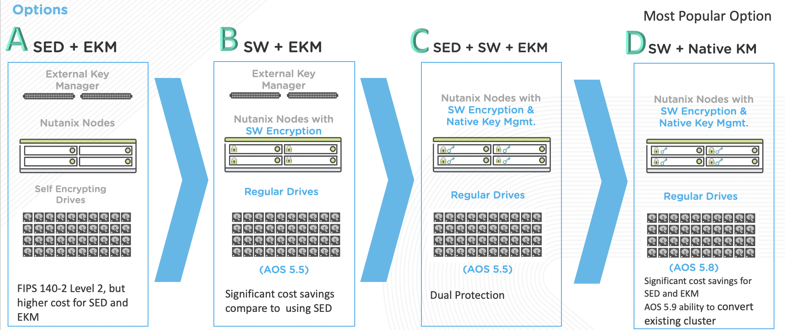
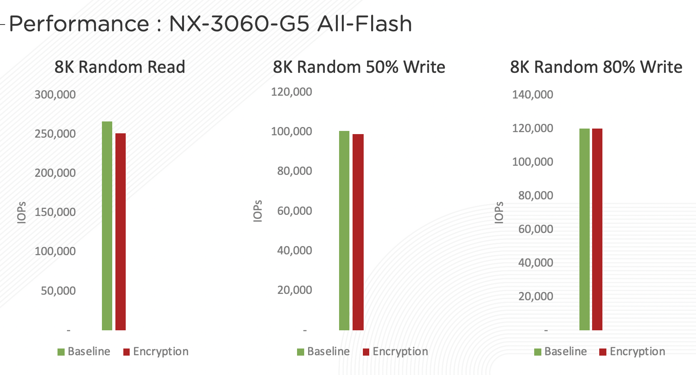
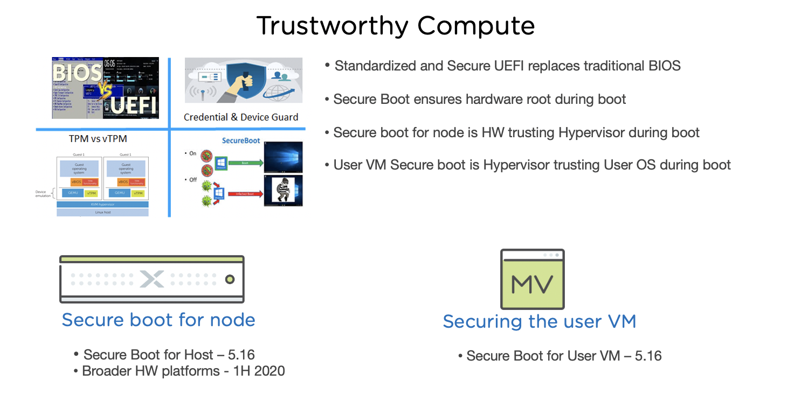

.. _platformmsecurity:

-----------------
Platform Security
-----------------

At Nutanix, security is a first-class citizen that drives best practices providing both defense in depth and a hardened by default posture for releases. In efforts to stay agile and effective when fighting the ever-increasing cyber security threads, Nutanix’s Security Development Life Cycle addresses security at every step of the development process instead of applying it at the end as an afterthought. This includes automated security testing during development and threat modeling to assess and mitigate customer risk from code changes.

Nutanix provides additional platform security capabilities, including:

- Security Technical Implementation Guide (STIG) Automation
- Software-based Data-at-Rest Encryption with integrated KMS
- Prism Audit Logs
- VM Secure Boot

Working with Nutanix STIGS
++++++++++++++++++++++++++

Nutanix also provides administrators with Security Technical Implementation Guides (STIGs), which are security tools encoded in a machine-readable format to facilitate automated validation, ongoing monitoring, and self-remediation. These reduce the time required to verify security compliance from weeks or months to days without slowing down product evolution. STIGs are based on well-established standards by National Institute of Standards and Technology (NIST) that can apply to multiple baseline requirements for DoD and PCI-DSS. However, Nutanix STIGs are specific to the Acropolis platform and therefore more effective.

In this lab you will see STIGs in action in order to see first-hand how they harden the Nutanix Enterprise Cloud OS and help reduce zero-day vulnerabilities.

   .. note::

      Nutanix AOS and AHV STIGs can be downloaded `here <https://portal.nutanix.com/#/page/static/stigs>`_ from the Nutanix Portal.

Running a STIG Report
.....................

Follow the exercise below to manually run a STIG report on your Nutanix cluster. By default, these checks run on a Nutanix cluster once every 24 hours, whereas in a typical legacy infrastructure environment, STIGs would be applied manually at the time of deployment and have no automated means of ensuring the original configuration is unchanged over time.

#. Connect to Controller VM (CVM) as nutanix user via SSH (Using Terminal, putty, or similar program)

#. Change to the root directory of the CVM

   .. code-block:: bash

     cd /

#. List the files available to the root user to execute within the /root directory.

   .. code-block:: bash

     sudo -u root ls -l root

     You should see a similar output:

   .. code-block:: bash

     nutanix@NTNX-14SX35100046-A-CVM:10.21.71.29:~# sudo -u root ls -l root
     total 248
     -rw-------. 1 root root   3314 Sep 11  2017 anaconda-ks.cfg
     drwxr-x---. 2 root root   4096 Dec 13 23:04 filesystems
     -rw-r-----. 1 root root   1132 May  3  2018 homeaudit.pp
     -rw-r-----. 1 root root   1231 May  3  2018 my-runcon.pp
     -rw-r-----. 1 root root    464 May  3  2018 my-runcon.te
     -rw-------. 1 root root   3222 Sep 11  2017 original-ks.cfg
     -rwxr-x---. 1 root root  10034 May  3  2018 report_open_jre8_stig.sh
     -rwx------. 1 root root 132760 Aug 30 23:50 report_stig.sh
     -rwxr-x---. 1 root root  72376 May  3  2018 report_web_stig.sh
     drwxr-x---. 2 root root   4096 Dec 13 23:17 sretools
     -rw-r-----. 1 root root    840 May  3  2018 sshdlocal.pp

   There should be three .sh files that end in _stig.sh and you’ll want to run the one that outputs the report in the format you prefer.

#. In this example, we’ll run the generic text output “report_stig.sh”

   .. code-block:: bash

     sudo -u root /root/report_stig.sh

     The output will go into the root user log folder.

     .. note::

       The command will take ~1 minute to complete.

#. List the files in the folder and note the name of the report.

   .. code-block:: bash

     sudo -u root ls -l /home/log | grep STIG

#. Copy the report to the nutanix home directory, substituting the actual file name for the asterisks.

   .. code-block:: bash

     sudo -u root cp /home/log/STIG-report-**-**-****-**-**-** /home/nutanix

#. List the files in the /home/nutanix folder.

   .. code-block:: bash

     ls -l ~

#. Change the owner of the report file to be the Nutanix user, substituting the actual file name for the asterisks.

   .. code-block:: bash

     sudo -u root chown nutanix:nutanix /home/nutanix/STIG-report-**-**-****-**-**-**

#. Use a secure copy tool (SCP, WINSCP, PSCP, etc) to copy the report results file to your workstation from the CVM. Alternatively you can open and view the text file in your SSH session using ``vi``, ``more``, ``cat``, etc.

   .. note::

     Be sure to login to the CVM using the **nutanix** username and browse to its home directory to find the file we created above.

Analyzing the STIG Report
.........................

The STIG report can be used for validation and accreditation requirements for security compliance.

The format of each result within the report is as follows:

- **Line 1** - Check name
- **Line 2** - Description of the check
- **Line 3** - Legend, or expected result of the check
- **Line 4** - Check result
- **Line 5** - Completion status of the check

Below is an example of a non-finding in the STIG report, meaning that the check did not discover an unwanted configuration:

::

   CAT II RHEL-07-021030 SRG-OS-000480-GPOS-00227 CCI-000366 CM-5 (1)
   All world-writable directories must be group-owned by root, sys, bin, or an application group.
   The result of the check should be yes.  If no, then it's a finding
   yes
   Completed.

And an example of a finding, where the check was found to have an unwanted configuration:

::

   CAT I RHEL-07-021710 SRG-OS-000095-GPOS-00049 CCI-000381 CM-7 a, CM-7 b
   The telnet-server package must not be installed.
   The result of the check should be yes.  If no, then it's a finding
   no
   Completed.

Compromising the Environment
............................

In this final exercise you will embrace your inner dark side and compromise the security of the cluster by making non-compliant changes - and you would have gotten away with it too, if it weren't for you pesky STIGs (*any Scooby Doo fans in the audience? No? OK just me then, fine.*).

Example 1
=========

#. The following text was extracted from one of the security checks under the AOS STIGs:

   - **Rule Version (STIG-ID)**: NTNX-51-000034
   - **Rule Title**: The /etc/shadow file must be group-owned by root.
   - **Fix Text**: salt-call state.sls security/CVM/fdpermsownerCVM

   In a Linux OS, secure user data, specifically encrypted passwords, are stored in the /etc/shadow file - making it a bad idea to provide non-root users with access to this sensitive file.

#. Change to the root directory of the CVM

   .. code-block:: bash

     cd /

#. Verify the current ownership:

   .. code-block:: bash

     sudo -u root ls -l etc/shadow
     ----------. 1 root root 943 Dec 18 15:37 /etc/shadow

#. Change the group ownership to **nutanix**:

   .. code-block:: bash

     sudo -u root chown root:nutanix /etc/shadow
     ls -l /etc/shadow
     ----------. 1 root nutanix 943 Dec 18 15:37 /etc/shadow

#. Manually run the salt call to fix this vulnerability:

   .. code-block:: bash

     sudo -u root salt-call state.sls security/CVM/fdpermsownerCVM

   .. note::

      While the calls to remediate the identified issues are made manually in this lab, all STIG related automation takes place once every 24 hours by default.

#. Verify the file is once again owned by the **root** group and not **nutanix**:

   .. code-block:: bash

     sudo -u root ls -l etc/shadow

Example 2
=========

This example focuses on the following check from the previously created report:

::

   All world-writable directories must be group-owned by root, sys, bin, or an application group.
   The result of the check should be yes.  If no, then it's a finding
   yes
   Completed.

If a world-writable directory, such as **/tmp**, were taken over by a bad actor, it could impact system operations and compromise security.

#. Change to the root directory of the CVM

   .. code-block:: bash

     cd /

#. You can search for this specific report from the CVM console where the report was run and using the following command, substituting the actual file name for the asterisks:

   .. code-block:: bash

     sudo -u root grep -A 4 -B 1 "All world-writable directories " /home/log/STIG-report-**-**-****-**-**-**

#. Observe that the output matches the beginning of the example. Let’s compromise the system so that this check says “no” and then manually fix the issue.

   .. note::

      If there is currently a finding for this check, another user may be in the middle of this exercise. You may still proceed.

#. Verify the current ownership:

   .. code-block:: bash

     sudo -u root ls -l / | grep  tmp
     drwxrwxrwt.  14 root root  1024 Dec 21 02:59 tmp

#. Change the group ownership:

   .. code-block:: bash

     sudo -u root chown root:nutanix /tmp

#. Verify the ownership change:

   .. code-block:: bash

     sudo -u root ls -l / | grep  tmp
     drwxrwxrwt.  14 root nutanix  1024 Dec 21 03:16 tmp

#. After we have achieved this, let’s re-run the report to see if this change has been detected

   .. code-block:: bash

     sudo -u root /root/report_stig.sh
     sudo -u root grep -A 4 -B 1 "All world-writable directories " /home/log/STIG-report-**-**-****-**-**-**

#. Observe the result of the check is now **no**, indicating a finding.

#. Manually run the salt call to fix this vulnerability:

   .. code-block:: bash

     sudo -u root salt-call state.sls security/CVM/fdpermsownerCVM

#. List the / directory again and note that the ‘compromise’ has been reverted back. Optionally you can re-run the report and verify there is no longer a finding for the check.

   .. code-block:: bash

     sudo -u root ls -l / | grep  tmp
     drwxrwxrwt.  14 root root  1024 Dec 21 03:42 tmp

Software Based Encryption
+++++++++++++++++++++++++

Data at Rest Encryption is a critical platform security capability:

- Ensures that user data does not leave data centers via failed disk drives
- Protects at-rest data against drive theft
- Required for compliance in many Federal, Healthcare, Financial, and Legal environments

Nutanix provides a number of different options for delivering Data at Rest Encryption.

Software-based encryption with Nutanix's integrated key management service (KMS) can provide a frictionless experience for enabling encryption without impacting performance.

Enabling software-based encryption is a one time operation at a per cluster level, so cannot be performed in a shared, lab environment. However, the brief, narrated video below walks you through the few steps required to enable this feature.

.. raw:: html

  
<iframe width="640" height="360" src="https://www.youtube.com/embed/-6fIL3FJjN8?rel=0&amp;showinfo=0&amp;t=53" frameborder="0" allow="accelerometer; autoplay; encrypted-media; gyroscope; picture-in-picture" allowfullscreen></iframe>

Audit Logs
++++++++++

System auditing is not only a good practice but often a security compliance requirement. Getting the history of changes or accesses made to a system (files, directories, system resources and system calls) into a service which can present those logs in a legible format is something your customers are going to want to do, and most likely within the first week of deploying their Nutanix cluster.

Nutanix can forward detailed system events to a syslog server in a few short minutes. In this narrated video you will learn what audit logs are available, where to configure a syslog server and what actions you can take to troubleshoot common problems.

.. raw:: html

  
<iframe width="640" height="360" src="https://www.youtube.com/embed/YuhC5nWd5Is?rel=0&amp;showinfo=0" frameborder="0" allow="accelerometer; autoplay; encrypted-media; gyroscope; picture-in-picture" allowfullscreen></iframe>

VM Secure Boot
++++++++++++++

New in AOS 5.16, Secure Boot for user VMs is a security feature in which AHV checks that the guest OS boot loader is signed with a cryptographic key authorized by a database contained in the UEFI firmware, verifying and trusting the integrity of the OS boot loader.

In 5.16, Secure Boot is not yet available through the Prism interface. In this brief, narrated video you will learn how to enable this feature for a VM using ``acli``.

.. raw:: html

  
<iframe width="640" height="360" src="https://www.youtube.com/embed/dRs5QpFke2U?rel=0&amp;showinfo=0" frameborder="0" allow="accelerometer; autoplay; encrypted-media; gyroscope; picture-in-picture" allowfullscreen></iframe>

Takeaways
+++++++++

- Nutanix is committed to providing a secure platform out of the box, including:

   - Automated application and remediation of STIGs
   - Multiple options for providing Data at Rest Encryption, including a simple to enable software-based option
   - Audit logging, including the ability to ship system and Flow logs to an external syslog server
   - Trusted boot technology for guest VMs running on AHV
